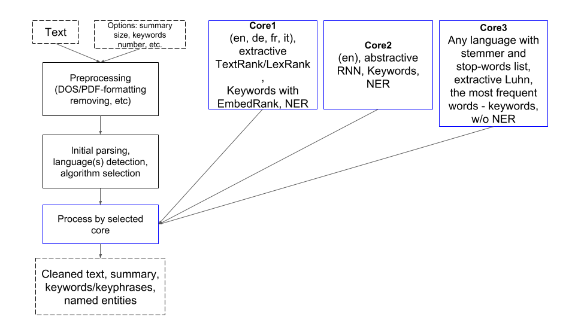

# Тема проекту: автоматичне створення анотації довільного тексту

Результатом проекту має стати бібліотека на Python, яка дозволить прийняти на вхід текст, а на виході мати автоматично складений реферат тексту, ключові слова, та, можливо, ще щось, наприклад іменовані сутності.

Такий функціонал часто потрібен в системах, котрі працюють с великою кількістю текстів (пошукові системи, системи документообороту тощо). Показ не всього документу, а тільки його анотації, або ключових слів (анотація анотації) в ідеалі має дати користувачу можливість швидше вирішити, чи це той документ, що йому потрібен. Частою особливістю таких систем є робота документами на різних мовах, навіть багатомовними документами, то ж актуальною стає можливість обробки таких документів, хоча б для основних європейських мов.

Анотація текстів зазвичай підрозділяється на extractive та abstractive підходи. Кожен з них має велику кількість різних реалізацій. Звичайно, найбільш інтересним є seq2seq нейромережі, але для їх тренування має буде досить велика кількість анотованих текстів, що має місце для англійської мови, але такі корпуси можуть бути важкодоступними для інших мов. Тож хочеться реалізувати бібліотеку, яка для різних мов, навіть для різних текстів та вимог до анотації, могла би підключати те чи інше ядро, яке найкращим чином може обробити переданий текст.

Пайплайн бібліотеки можна уявити таким чином:

Які NLP-tasks треба буде вирішити у процесі роботи над проектом:

* Оцінка якості. Частіше за все, для автоматичної оцінки якості анотацій та переліку ключових слів використовуються метрики BLEU та ROUGE. Вони базуються на корпусах, які були проанотовані людьми. Але, це лише приблизні оцінки, які мають багато вад (про них можна написати окрему статтю). То ж треба виділити ще деякий час на огляд цього питання. І тільки після створення коректної системи контролю якості можна рухатися далі.
* Знайти, або створити анотовані корпуси для неанглійських мов. Звичайно, можна екстрапольовувати результати роботи алгоритму з англійської на інші європейські мови, але навіть тут є великий ризик зіткнутися з помилками такої екстраполяції 
* Як бейзлайн, пропонуються такі алгоритми:
  *	Анотація: беремо перші N речень тексту. Хоча це може здатися дурницею, але, судячи зі статей, багато abstractive алгоритмів лише трохи поліпшують цей показник. Це пов’язано з тим, що на початку тексту часто кратко описується, про що далі буде йти мова.
  * Ключові слова: беремо N слів, які найчастіше зустрічаються у тексті, за винятком стоп-слів.
* Розпізнавання мови. Для одномовних текстів є досить добре працюючі рішення, але якщо ми будемо працювати з багатомовними документами (як приклад – договір на двох мовах), то треба розпізнавати мову речення. А на коротких фрагментах вже існуючі алгоритми досить часто дають збої (особливо для мов однієї групи).
* Хоча, планується, що бібліотеці на вхід буде приходити UNICODE plain-text, все ж таки певну передобробку треба проводити. Практика показує, що однією з проблем є неправильне форматування – або так зване DOS-форматування, коли кнопка «ENTER» застосовується для переносу частини речення на наступну строку, часто навіть ставиться символ «-» для переносу слова. Це зустрічається не дуже рідко, особливо у великих файлосмітниках. Іншою схожою проблемою є те, что схожий, але ще гірший вигляд має конвертований у текст PDF. 
* І тепер ми наблизилися саме до задачі анотування текстів. 
  * Насамперед, тут хочеться реалізувати щось стабільне, універсальне та мінімально мовозалежне. Це буде і бейзлайн і fallback ядро, яке буде працювати в умовах, коли нема нічого ліпшого.
  * Далі хочеться поекспериментувати із більш сучасними підходами, які застосовують word embeddings, machine-learning.
  * Наприкінці хочеться торкнутися теми seq2seq нейромереж. Хоча б для однієї мови.
* NEC/NER аналіз планую застосовувати у вигляді готових рішень на шталт spaCy, etc.
